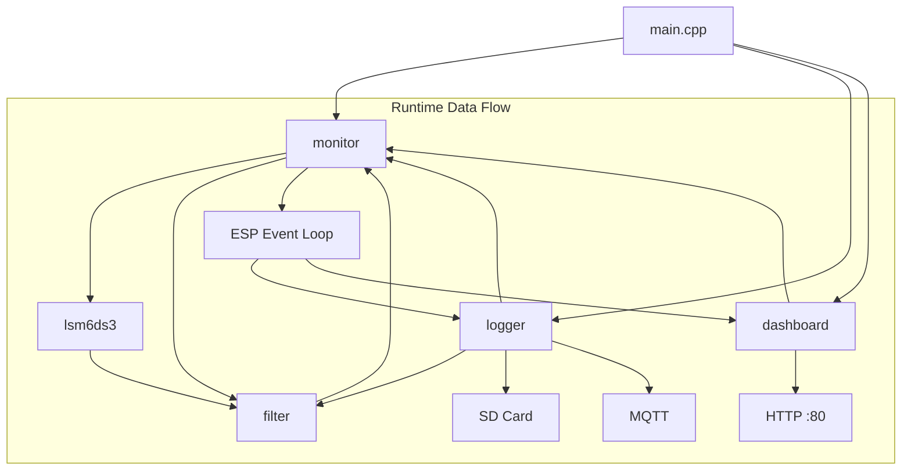
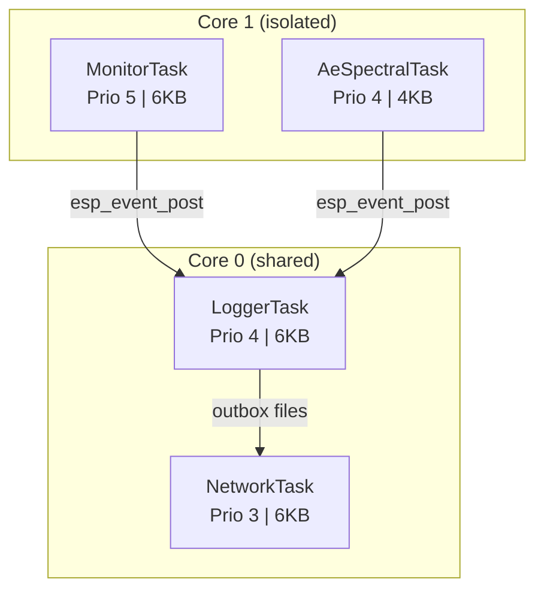
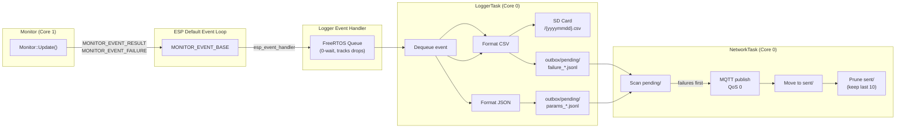
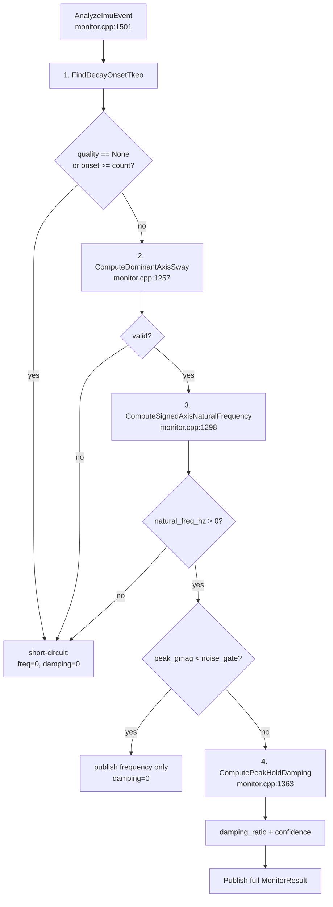

# ARCHITECTURE.md — Agent Reference

Ranting Jatuh Node: ESP32-S3 firmware for tree-branch structural health monitoring. Reads IMU + AE sensors, extracts modal parameters, logs to microSD, publishes to MQTT.

**Target:** ESP32-S3FH4R2, ESP-IDF v5.5.4, C++17 (no exceptions, no RTTI, no heap in hot paths).
**Python reference:** `imu_algorithms/` — offline validation pipeline. Core algorithms match C++.

---

## 1. File Map

| Path | Size | Description |
|------|------|-------------|
| `main/main.cpp` | 359 L | Boot sequence: I2C init, SD mount, task creation |
| `main/verify.cpp` / `.hpp` | — | Startup self-tests (SD, MQTT, IMU, stack) |
| `main/raw_logger_main.cpp` | — | Alternate build: raw IMU-to-SD CSV recorder |
| `main/test_main.cpp` | — | Unity test runner entry |
| `main/pins.hpp` | 51 L | GPIO pinout for custom PCB |
| `main/CMakeLists.txt` | — | Three build variants: normal / raw-logger / tests |
| `components/monitor/monitor.cpp` | 1589 L | Core: FSM, TKEO, FFT, damping, AE spectral |
| `components/monitor/include/monitor.hpp` | 528 L | Public API, structs, constants, FSM classes |
| `components/monitor/include/monitor_events.hpp` | — | ESP event declarations (MONITOR_EVENT_BASE) |
| `components/monitor/include/calibration.hpp` | — | CalibrationBias struct + NVS read/write |
| `components/monitor/CMakeLists.txt` | — | Req: lsm6ds3, filter, esp-dsp, esp_timer, driver, esp_adc |
| `components/monitor/Kconfig` | — | All MONITOR_* config keys |
| `components/monitor/test/` | — | test_monitor_modal.cpp, test_monitor_algorithms.cpp, test_logger_formatting.cpp |
| `components/logger/logger.cpp` | 388 L | Task loop, event dequeue, format + dispatch |
| `components/logger/logger_mqtt.cpp` | 173 L | Node ID gen, topic builder, NVS init |
| `components/logger/logger_storage.cpp` | 147 L | SD CSV append (parameters + failures) |
| `components/logger/outbox.cpp` | 370 L | SD upload queue: pending/ + sent/ dirs |
| `components/logger/network_task.cpp` | 423 L | WiFi-to-MQTT publish, NTP sync, backoff |
| `components/logger/network_strategy.hpp` / `.cpp` | — | Interface for WiFi strategy |
| `components/logger/network_on_demand.cpp` | — | WiFi connect-publish-disconnect (field deployment) |
| `components/logger/network_persistent.cpp` | — | WiFi always-on (dashboard mode) |
| `components/logger/include/logger.hpp` | — | Public Logger API |
| `components/logger/include/logger_internal.hpp` | — | CsvLine, TimeInfo, format helpers, mqtt/storage namespaces |
| `components/logger/include/outbox.hpp` | — | Outbox public API |
| `components/logger/include/network_task.hpp` | — | Network task public API |
| `components/logger/include/mqtt_log.hpp` | — | MQTT log ring buffer for dashboard |
| `components/logger/CMakeLists.txt` | — | Req: monitor, nvs_flash, esp_wifi, mqtt |
| `components/logger/Kconfig` | — | All LOGGER_* config keys |
| `components/lsm6ds3/lsm6ds3.cpp` | — | Register-level IMU driver |
| `components/lsm6ds3/include/lsm6ds3.hpp` | — | Public driver API (Config, IntConfig, FifoMode, etc.) |
| `components/lsm6ds3/include/lsm6ds3_detail.hpp` | — | Register map, ODR enums, Value structs |
| `components/filter/include/adaptive_complementary_filter.hpp` | — | **ONLY ACTIVE FILTER IN THIS PROJECT** |
| `components/filter/include/complementary_filter.hpp` | — | Library only, not instantiated |
| `components/filter/include/madgwick_filter.hpp` | — | Library only, not instantiated |
| `components/filter/include/kalman_filter.hpp` | — | Library only, not instantiated |
| `components/filter/include/ekf_filter.hpp` / `.cpp` | — | Compiled but never instantiated |
| `components/filter/include/filter_math.hpp` | — | deg/rad helpers |
| `components/dashboard/dashboard.cpp` | 1101 L | HTTP handlers: /api/status, /api/logs, file download |
| `components/dashboard/include/dashboard.hpp` | — | Dashboard public API |
| `imu_algorithms/_calibration.py` | — | Python reference: static bias subtraction |
| `imu_algorithms/_detection.py` | — | Python reference: TKEO + Schmitt trigger + event classifier |
| `imu_algorithms/_envelope.py` | — | Python reference: peak-hold + decay onset + OLS damping |
| `imu_algorithms/_extraction.py` | — | Python reference: FFT + zero-crossing + peak frequency + Pipeline |
| `imu_algorithms/_ringbuffer.py` | — | Python reference: ring buffer for streaming path |
| `imu_algorithms/_io.py` | — | Python reference: CSV loading utilities |
| `docs/natural-frequency-pipeline.md` | — | Deep-dive on FFT + damping algorithm |
| `openspec/specs/` | — | 17 capability specs |
| `openspec/changes/` | — | 1 active change + archive/ |
| `README.md` | — | Project overview |
| `mqtt_interface.md` | — | MQTT topic schema |
| `CMakeLists.txt` | — | Top-level ESP-IDF project file |
| `sdkconfig.defaults` | — | MQTT v5, log v2 |

---

## 2. Component Dependency Graph



**Compile-time dependency chain** (from CMakeLists REQUIRES):

| Component | Depends On |
|-----------|------------|
| `main` | monitor, logger, dashboard, sdmmc, fatfs |
| `monitor` | lsm6ds3, filter, esp-dsp, esp_timer, driver, esp_adc |
| `logger` | monitor, nvs_flash, esp_wifi, esp_event, mqtt, esp_timer |
| `lsm6ds3` | driver |
| `filter` | (none, header-only except ekf_filter.cpp) |
| `dashboard` | monitor, esp_http_server, esp_wifi |

---

## 3. FreeRTOS Task Layout

| Task | Core | Priority | Stack (bytes) | Role |
|------|------|----------|---------------|------|
| **MonitorTask** | 1 | 5 | 6144 | IMU loop @ IMU_RATE_HZ. FSM + TKEO + modal analysis. Checks failure events (free-fall, AE). Posts MONITOR_EVENT_RESULT, MONITOR_EVENT_FAILURE. |
| **AeSpectralTask** | 1 | 4 | 4096 | Only if AE_MODE_SPECTRAL_ADC. Continuous ADC → FFT → detector update. |
| **LoggerTask** | 0 | 4 | 6144 | Dequeue events → format CSV + JSON → SD write (blocking VFS) → outbox/pending/ write. |
| **NetworkTask** | 0 | 3 | 6144 | WiFi connect → MQTT publish. NTP sync → drain outbox → move to sent/ → disconnect. Exponential backoff on failure. |



**Key invariant:** Monitor runs on Core 1 alone. Logger + Network share Core 0. This prevents WiFi/SD I/O jitter from perturbing IMU sampling timing.

**Scheduling:** `vTaskDelayUntil` for monitor loop (not timer ISR). Simple, deterministic at 26 Hz. IMU FIFO is intentionally unused (future optimization).

---

## 4. Inter-Component Communication



**Why ESP event loop?** Monitor doesn't know about Logger or Dashboard. New subscribers just register a handler. Event handler MUST return quickly (payload copied to queue with 0-wait).

**Why SD outbox?** Every MQTT payload lands on SD BEFORE network publish. Survives reboot, WiFi outage, broker restart. Trade-off: 2× I/O per payload.

---

## 5. Data Pipeline (Step by Step)

```mermaid
flowchart LR
    A[1. Read IMU<br/>LSM6DS3 @ 26 Hz<br/>raw accel + gyro] --> B[2. Calibrate<br/>calibrated = raw - bias<br/>NVS key: imu_bias]
    B --> C[3. Adaptive Complementary Filter<br/>roll/pitch in degrees<br/>self-tuning alpha]
    C --> D[4. Gyro Magnitude<br/>gmag = sqrt gx^2+gy^2+gz^2]
    D --> E[5. TKEO Window<br/>3-sample sliding<br/>psi[n] = x[n-1]^2 - x[n-2]x[n]]
    E --> F[6. Schmitt Trigger FSM<br/>DspDisturbanceDetector]
    F --> G[7. Buffer Management<br/>IDLE/DISTURBED/refresh]
    G --> H[8. Post-Hoc Modal Analysis<br/>AnalyzeImuEvent<br/>see section 6]
    H --> I[9. Failure Detection<br/>parallel hardware paths]
```

| Step | What | Key Source |
|------|------|------------|
| 1 | LSM6DS3 @ 26 Hz default; raw accel [g] + gyro [dps] | `monitor.cpp` TaskLoop(), ReadImu(), imu_.ReadGyroAccel() |
| 2 | `calibrated = raw - bias`. Biases in NVS key "imu_bias" (CalibrationBias blob). Hardcoded defaults at `main.cpp:247-255`. | `calibration.hpp` |
| 3 | Roll/pitch [deg]. Self-tuning alpha: `alpha = 1 - (1 - alpha_base) * 1/(1 + K * abs(accel_mag - 1.0))` | `adaptive_complementary_filter.hpp:34` |
| 4 | `gmag = sqrt(gx^2 + gy^2 + gz^2)` | inline in Monitor::Update() |
| 5 | TKEO 3-sample sliding window: `psi[n] = x[n-1]^2 - x[n-2] * x[n]`. 1-sample latency. | `monitor.cpp:68 TkeoWindow::Push()` |
| 6 | Schmitt trigger FSM: IDLE/DISTURBED with hysteresis + quiet debounce. | `monitor.cpp:96 DspDisturbanceDetector::Update()` |
| 7 | IDLE: rolling history + short buffer. IDLE->DISTURBED: short buffer -> event buffer. DISTURBED: refresh if near full. DISTURBED->IDLE: AnalyzeImuEvent(), publish, reset. | `monitor.cpp` PushSample(), ComputeAndPublish() |
| 8 | TKEO decay onset -> dominant axis -> FFT natural freq -> peak-hold envelope OLS damping. Runs on DISTURBED->IDLE only. | See §6 |
| 9 | Free-fall: LSM6DS3 INT1 -> WAKE_UP_SRC. AE GPIO: GPIO15 rising ISR. AE ADC: ADC1_CH0 vs threshold. AE Spectral: AeSpectralTask -> continuous ADC -> FFT -> energy -> latch. | `monitor.cpp` CheckFailureEvents() |

---

## 6. Post-Hoc Modal Analysis Pipeline

Triggered on DISTURBED→IDLE only (NOT on buffer refresh). Full sequence:



**Stage details:**

| Stage | Function | File:Line | What it does |
|-------|----------|-----------|--------------|
| 1. Decay onset | `FindDecayOnsetTkeo()` | `monitor.cpp` | Non-negative TKEO over gmag buffer. energy_floor = (10 × 0.35)². threshold = max(energy_floor, 0.30 × max(psi_pos)). Find last psi_pos > threshold → snap to nearest local gmag peak (±0.45s). Validate: ≥20 samples, ≥2× amplitude drop. Returns onset index + quality (Reliable/Low/None). |
| 2. Dominant axis | `ComputeDominantAxisSway()` | `monitor.cpp:1257` | Integrate gx, gy, gz: angle = sum(gyro_axis × dt). Sway = max(cumsum) - min(cumsum) per axis. Dominant = largest peak-to-peak. Returns SwayAxisResult. |
| 3. Natural freq | `ComputeSignedAxisNaturalFrequency()` | `monitor.cpp:1298` | Signed dominant-axis gyro[onset..end]. Truncate to last min(count,1024). De-mean → Hann → zero-pad 512/1024. dsps_fft2r_fc32 → dsps_bit_rev_fc32. Scan power in band (0.5–12 Hz). Peak bin → Hz. |
| 3.5 Noise gate | (inline in AnalyzeImuEvent)| `monitor.cpp:1525` | If peak_gmag < noise_gate_gmag_dps → skip damping, publish frequency only. |
| 4. Damping | `ComputePeakHoldDamping()` | `monitor.cpp:1363` | Asymmetric peak-hold envelope: env[n] = max(gmag[n], alpha×env[n-1]), alpha=exp(-2π×fc×dt), fc=2Hz. Skip 1st cycle. Lower bound: max(4×0.35, 0.03×peak). OLS on ln(env) vs time: zeta = -slope/(2π×fn). |

**Confidence tiers:**

| Tier | Criteria |
|------|----------|
| **high** | R² > 0.90 AND ≥3 cycles AND ≥2× amplitude drop AND >4 samples/cycle AND quality == Reliable |
| **medium** | R² > 0.70 AND ≥2× drop |
| **low** | Everything else (including all gate failures) |

**FFT parameter reference:**

| Parameter | Kconfig | C++ Field | Default |
|-----------|---------|-----------|---------|
| Sample rate | `MONITOR_IMU_RATE_HZ` | — | 26 Hz |
| FFT max window | hardcoded | `kFftWindowSamples` | 1024 |
| Min search freq | `MONITOR_MODAL_FREQ_MIN_HZ_X10` | `modal_freq_min_hz` | 0.5 Hz |
| Max search freq | `MONITOR_MODAL_FREQ_MAX_HZ_X10` | `modal_freq_max_hz` | 12.0 Hz |
| TKEO high | `MONITOR_DSP_TKEO_HIGH_X10` | `dsp_tkeo_high` | 40.0 |
| TKEO low | `MONITOR_DSP_TKEO_LOW_X10` | `dsp_tkeo_low` | 5.0 |
| Gmag onset | `MONITOR_DSP_GMAG_ONSET_X100` | `dsp_gmag_onset_dps` | 2.0 dps |
| Gmag quiet | `MONITOR_DSP_GMAG_QUIET_X100` | `dsp_gmag_quiet_dps` | 1.5 dps |
| Quiet debounce | `MONITOR_DISTURBED_EXIT_DEBOUNCE` | `dsp_quiet_debounce` | 64 samples |
| Noise gate | `MONITOR_NOISE_GATE_GMAG_X10` | `noise_gate_gmag_dps` | from Kconfig |

**Deep-dive:** `docs/natural-frequency-pipeline.md` has full algorithm trace, gate chain, confidence tiers, bin resolution tables, and C++ vs Python comparison.

---

## 7. MonitorResult Output Fields

```cpp
// monitor.hpp:119
struct MonitorResult {
    float roll_mean, roll_variance, pitch_mean, pitch_variance;
    float roll_sway_pp_max, roll_sway_pp_mean, pitch_sway_pp_max, pitch_sway_pp_mean;
    float roll_damping_ratio, pitch_damping_ratio;      // ← mirrored from dominant axis
    float natural_freq_hz;                              // ← dominant axis
    float natural_freq_roll_hz, natural_freq_pitch_hz;  // ← mirrored from natural_freq_hz
    char damping_confidence[8];  // "high\0", "medium\0", "low\0"
    NodeState state;             // IDLE or DISTURBED
    uint32_t sample_count;
    uint64_t timestamp_us;
};
```

**Important:** Single dominant axis result. Roll and pitch fields carry the same value — the dominant axis is selected per-event by `ComputeDominantAxisSway()`. Per-axis naming is for backward MQTT schema compatibility only.

---

## 8. Memory Budget (Monitor)

All buffers are compile-time fixed-size `std::array` members. No heap in hot paths.

| Buffer | Type | Size | Compute |
|--------|------|------|---------|
| `roll/pitch/gmag_history_` | `float[kStorageSamples]` | ~31 KB each | 5 min × 26 Hz = 7800 |
| `gx/gy/gz/ax/ay/az_history_` | `float[kEventSamples]` | ~8 KB each | 2048 |
| `roll/pitch/gmag/..._short_` | `float[kShortBufferSamples]` | configurable | Pre-trigger |
| `fft_input_` | `float[2048]` (interleaved) | 8 KB | FFT workspace |
| `psd_accum_` | `float[512]` | 2 KB | Dashboard PSD |
| `residual_scratch_` | `float[kStorageSamples]` | ~31 KB | Residual calc |
| `ae_sample_window_` | `uint16_t[kAeSpectralMaxWindowSamples]` | ≤2 KB | AE spectral |
| `ae_fft_buffer_` | `float[2× window]` | ≤8 KB | AE FFT |
| `stream_samples_` | `StreamSample[20]` | ~680 B | Dashboard live |

Total Monitor RAM: ~150–200 KB. Bounded by static_assert in monitor.hpp.

Logger uses stack-allocated `CsvLine` (512 B) and path buffers (~128 B). No persistent heap beyond what ESP-MQTT allocates internally.

---

## 9. MQTT Interface

| Topic | Content-Type | Payload | When |
|-------|-------------|---------|------|
| `ranting/{node_id}/parameters` | `application/json` | JSON (schema: mqtt_interface.md) | State transitions + IDLE periodic + buffer refresh |
| `ranting/{node_id}/failures` | `text/csv` | `unix_time,timestamp_us,event_name` | On detection |
| `ranting/{node_id}/verify` | (JSON) | Self-test results | Startup (if CONFIG_APP_VERIFY_ENABLE) |

**Node ID:** From `CONFIG_LOGGER_NODE_ID` → NVS → auto-generate adjective-noun (e.g. "quiet-pine").
**QoS:** 0 (at most once).
**Batching:** Deployment batches parameters per publish cycle (on-demand WiFi). Debug mode may publish per event.

Full schema: `mqtt_interface.md`.

---

## 10. Kconfig Key → C++ Field Mapping

All Kconfig defaults have scaled-integer representation (×10 or ×100) to avoid floating-point in Kconfig.

| Kconfig | Scale | C++ Field | MonitorConfig line |
|---------|-------|-----------|-------------------|
| `MONITOR_IMU_RATE_HZ` | 1:1 | — (direct constant) | — |
| `MONITOR_STORAGE_MINUTES` | 1:1 | — (→ kStorageSamples) | — |
| `MONITOR_MODAL_FREQ_MIN_HZ_X10` | ÷10 | `modal_freq_min_hz` | monitor.hpp:89 |
| `MONITOR_MODAL_FREQ_MAX_HZ_X10` | ÷10 | `modal_freq_max_hz` | monitor.hpp:90 |
| `MONITOR_DSP_TKEO_HIGH_X10` | ÷10 | `dsp_tkeo_high` | monitor.hpp:91 |
| `MONITOR_DSP_TKEO_LOW_X10` | ÷10 | `dsp_tkeo_low` | monitor.hpp:92 |
| `MONITOR_DSP_GMAG_ONSET_X100` | ÷100 | `dsp_gmag_onset_dps` | monitor.hpp:93 |
| `MONITOR_DSP_GMAG_QUIET_X100` | ÷100 | `dsp_gmag_quiet_dps` | monitor.hpp:94 |
| `MONITOR_DISTURBED_EXIT_DEBOUNCE` | 1:1 | `dsp_quiet_debounce` | monitor.hpp:95 |
| `MONITOR_NOISE_GATE_GMAG_X10` | ÷10 | `noise_gate_gmag_dps` | monitor.hpp:96 |
| `MONITOR_PEAK_MIN_AMPLITUDE_X10` | ÷10 | `peak_min_amplitude_deg` | monitor.hpp:87 |
| `MONITOR_PEAK_MIN_SPACING_SAMPLES` | 1:1 | `peak_min_spacing` | monitor.hpp:88 |

---

## 11. PIN Assignments (Custom PCB)

```cpp
// main/pins.hpp
IMU_SDA    = GPIO 5    (I2C Data)
IMU_SCL    = GPIO 6    (I2C Clock, 400 kHz)
IMU_INT1   = GPIO 2    (Free-fall interrupt)
IMU_INT2   = GPIO 3    (Unused)
IMU_CS     = GPIO 7    (SPI CS — unused, I2C is active)
IMU_SDO_SA0= GPIO 4    (I2C address LSB → 0x6A)
SD_CLK     = GPIO 12   (SDMMC/SPI Clock)
SD_CMD_DI  = GPIO 11   (SDMMC CMD / SPI MOSI)
SD_DAT0_DO = GPIO 13   (SDMMC DAT0 / SPI MISO)
SD_DAT3_CS = GPIO 10   (SPI Chip Select, SPI mode only)
SD_DET     = GPIO 9    (Card detect — not actively used)
SD_BATT    = GPIO 8    (Battery monitor — not actively used)
AE_ADC_PIN = GPIO 1    (ADC1_CH0, analog AE input)
AE_GPIO_PIN= GPIO 15   (Digital AE interrupt)
TX         = GPIO 43   (Debug UART)
RX         = GPIO 44   (Debug UART)
```

---

## 12. Known Limitations (Actionable)

| # | Issue | Location | Impact |
|---|-------|----------|--------|
| 1 | Dominant axis uses cumulative sum (not peak-to-peak) | `ComputeDominantAxisSway()` monitor.cpp | Symmetric oscillations → near-zero cumulative → wrong dominant axis |
| 2 | No frequency cross-validation (FFT only) | `ComputeSignedAxisNaturalFrequency()` | No detection of FFT artifacts or signal quality issues |
| 3 | No event-type gating (all disturbances get damping) | `AnalyzeImuEvent()` → `ComputePeakHoldDamping()` | Noisy/meaningless damping for non-oscillatory events |
| 4 | FFT tail truncation (last 1024 only) | `ComputeSignedAxisNaturalFrequency()` | Early decay (higher SNR) may be discarded |
| 5 | No Python parity: classify_event, is_dynamic, extract_active_region | — | Missing event classification + active region extraction |

When fixing #1: Python reference uses `max(cumsum) - min(cumsum)` for sway amplitude. C++ does the same but `DominantAxis` selection may differ from Python. Check `imu_algorithms/_extraction.py:extract_active_sway()`.

---

## 13. Build & Verify

```powershell
# Source ESP-IDF environment (PowerShell)
. 'C:\Espressif\frameworks\esp-idf-v5.5.4\export.ps1'

# Configure (first time)
idf.py set-target esp32s3
idf.py menuconfig

# Build
idf.py build

# Flash + monitor
idf.py -p COMx flash monitor

# Unit tests (on target)
idf.py -T monitor test

# Verify after changes
idf.py build           # Must compile clean (no warnings)
```

**MonitorConfig defaults** are set in `monitor.hpp:80-108` as `MonitorConfig{} = default` using C++ field initializers reading Kconfig values. Any new Kconfig key must have a corresponding field in MonitorConfig and a default value.

---

## 14. Invariants (DO NOT BREAK)

1. **No heap in hot paths.** All buffers are compile-time fixed `std::array`. No `new`, `malloc`, `std::vector` in Monitor::Update(), LoggerTaskLoop(), or NetworkTask publish loop.

2. **Monitor runs on Core 1 alone.** Do not move it to Core 0 — WiFi/BT stack on Core 0 causes cache-line contention.

3. **ESP event callback returns immediately.** Event handler copies payload to queue with `portMAX_DELAY` never used — must be 0-wait or bounded tick wait for queue send.

4. **No exceptions.** C++ exceptions disabled (`-fno-exceptions`). All error handling is `esp_err_t` or `bool` return.

5. **No RTTI.** `-fno-rtti`. No `dynamic_cast`, no `typeid`.

6. **static_assert all buffer assumptions.** Buffer size relationships, alignment, power-of-two checks MUST be static_assert, not runtime checks.

7. **SD writes before MQTT.** Every payload persisted to outbox/pending/ BEFORE any MQTT publish attempt. Data must survive reboot.

8. **Kconfig values use scaled integers.** Floating-point configs use ×10 or ×100 representation. Runtime conversion in MonitorConfig field initializers.

9. **MonitorResult fields for roll/pitch are mirrors.** `roll_damping_ratio == pitch_damping_ratio`. `natural_freq_roll_hz == natural_freq_pitch_hz == natural_freq_hz`. Single dominant axis.

---

## 15. OpenSpec Integration

Active specs live in `openspec/specs/`. 17 capability specs cover every subsystem. Current active change: `document-natural-frequency-pipeline` (complete).

**Before implementing any change:** Read the relevant spec. Specs define behavior; code implements it.

**Key specs by area:**

| Area | Spec |
|------|------|
| FSM | `node-state-machine` |
| Modal analysis | `free-decay-analysis`, `imu-event-analysis`, `envelope-damping-regression` |
| Noise gate | `noise-gate` |
| AE detector | `ae-spectral-detector` |
| Calibration | `imu-calibration`, `accel-error-state-detection` |
| Network | `network-strategy`, `network-task` |
| Storage | `sd-upload-queue`, `raw-imu-recording` |
| Dashboard | `dashboard-file-download`, `dashboard-fsm-adaptation`, `dashboard-time-format-fix` |
| Runtime | `embedded-runtime-safety`, `monitor-mutex-safety` |
| Identity | `node-id-topic-prefix`, `startup-time-sync` |
| Filter | `adaptive-complementary-filter` |
