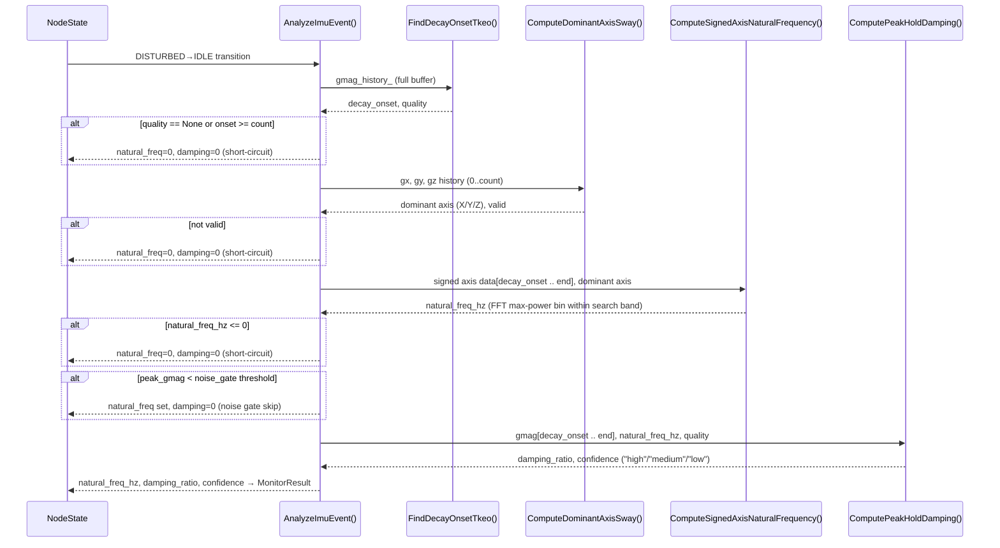
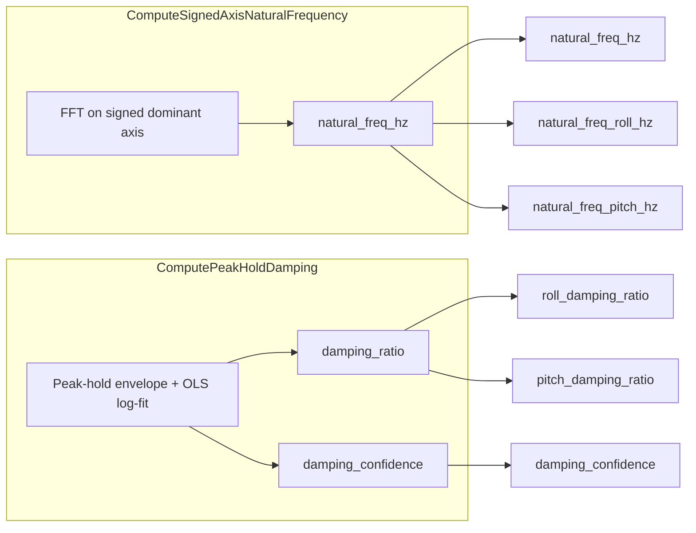

 # Natural Frequency & Damping Pipeline

> **Last verified:** 2026-06-16 against `components/monitor/monitor.cpp` @ 5bb1d4e
>
> This document describes the current C++ firmware implementation. If the pipeline changes (new gates, different FFT strategy, modified confidence logic), update this document. Cross-reference line numbers to source files to detect drift.

## Overview

The natural frequency and damping ratio are computed on **DISTURBED-to-IDLE** state transitions by `Monitor::AnalyzeImuEvent()` (`monitor.cpp:1501`). The pipeline chains five stages:

```
FSM transition → Decay onset (TKEO) → Dominant axis (sway) → FFT (signed gyro) → Damping (OLS log-fit)
```

Each stage is gated — if any returns invalid, the pipeline short-circuits with zero results. This document traces the full data flow from state machine trigger to published `MonitorResult` fields.

**Related OpenSpec specs:** [`free-decay-analysis`](../openspec/specs/free-decay-analysis/spec.md), [`imu-event-analysis`](../openspec/specs/imu-event-analysis/spec.md), [`envelope-damping-regression`](../openspec/specs/envelope-damping-regression/spec.md), [`noise-gate`](../openspec/specs/noise-gate/spec.md), [`node-state-machine`](../openspec/specs/node-state-machine/spec.md)

---

## Pipeline Sequence



### Key source locations

| Stage | Function | File:Line |
|-------|----------|-----------|
| FSM trigger + orchestration | `AnalyzeImuEvent()` | `monitor.cpp:1501` |
| Decay onset detection | `FindDecayOnsetTkeo()` | `monitor.cpp` (grep `FindDecayOnsetTkeo`) |
| Dominant axis selection | `ComputeDominantAxisSway()` | `monitor.cpp:1257` |
| Natural frequency (FFT) | `ComputeSignedAxisNaturalFrequency()` | `monitor.cpp:1298` |
| Damping regression | `ComputePeakHoldDamping()` | `monitor.cpp:1363` |
| FFT bin range helper | `SelectFftBinRange()` | `monitor.cpp:851` |

---

## FFT Internals

```mermaid
flowchart LR
    A[Signed gyro data<br/>from decay region] --> B[Truncate to last<br/>min&#40;count, 1024&#41; samples]
    B --> C[Mean-center<br/>&#40;val - mean&#41;]
    C --> D[Apply Hann window<br/>0.5 - 0.5*cos&#40;...&#41;]
    D --> E[Zero-pad real values<br/>to FFT size]
    E --> F[ESP-DSP radix-2<br/>dsps_fft2r_fc32&#40;&#41;]
    F --> G[Bit-reversal<br/>dsps_bit_rev_fc32&#40;&#41;]
    G --> H[Scan power &#40;real² + imag²&#41;<br/>within search band only]
    H --> I[Select max-power bin]
    I --> J[Convert: freq =<br/>max_bin × sample_rate / fft_size]
    J --> K[Return Hz or 0.0 if bin 0]
```



### Sample window logic (`ComputeSignedAxisNaturalFrequency()`)

```
If count ≤ 4: return 0.0
If count > 1024: use most recent 1024 samples (truncate from start)
If count ≤ 512: FFT size = 512
If count > 512: FFT size = 1024
```

Only the tail of the decay region is analyzed — the samples closest to the IDLE transition.

### Windowing

A **Hann window** is applied to the mean-centered data:

```
window[i] = 0.5 - 0.5 * cos(2π * i / (count - 1))
fft_input[2*i] = (val[i] - mean) * window[i]
fft_input[2*i + 1] = 0.0  (imaginary)
```

The imaginary components are zeroed since the input is real-valued. ESP-DSP's `dsps_fft2r_fc32` is a complex FFT that accepts interleaved real/imaginary pairs.

### Search band

Only FFT bins within a **configurable frequency band** are considered for max-power selection:

```
min_bin = ceil(config.modal_freq_min_hz * fft_size / sample_rate)
max_bin = floor(config.modal_freq_max_hz * fft_size / sample_rate)

min_bin = max(min_bin, 1)           // exclude DC bin
max_bin = min(max_bin, fft_size/2 - 1)  // cap at Nyquist
```

If `min_bin > max_bin` or the band is otherwise invalid, frequency returns 0.0.

---

## FFT Parameter Reference

| Parameter | Kconfig Key | C++ Field | Default | Description |
|-----------|------------|-----------|---------|-------------|
| IMU sample rate | `CONFIG_MONITOR_IMU_RATE_HZ` | (direct constant) | 26 Hz | All pipeline timing derives from this |
| FFT window size | (hardcoded) | `kFftWindowSamples` | 1024 | Maximum FFT size; actual is 512 or 1024 |
| Min search freq | `CONFIG_MONITOR_MODAL_FREQ_MIN_HZ_X10` | `config_.modal_freq_min_hz` | 0.5 Hz | DC and sub-harmonics excluded |
| Max search freq | `CONFIG_MONITOR_MODAL_FREQ_MAX_HZ_X10` | `config_.modal_freq_max_hz` | 12.0 Hz | Upper bound of plausible branch oscillation |
| Peak gmag threshold | `CONFIG_MONITOR_DSP_TKEO_HIGH_X10` | `config_.dsp_tkeo_high` | 40.0 | TKEO threshold for DISTURBED entry |
| Noise gate gmag | `CONFIG_MONITOR_NOISE_GATE_GMAG_X10` | `config_.noise_gate_gmag_dps` | (from Kconfig) | Minimum peak gmag for damping computation |
| Disturbance buffer | `CONFIG_MONITOR_STORAGE_MINUTES` | `kStorageSamples` | 5 min × rate | Total ring buffer duration |
| Decay buffer max | (hardcoded) | `kEventSamples` | 2048 | Max event samples for analysis |

### Bin resolution

At the default 26 Hz sample rate:

| FFT Size | Resolution | Nyquist | 0.5 Hz bin | 12 Hz bin | Bins in band |
|----------|-----------|---------|-----------|----------|--------------|
| 512 | 0.0508 Hz | 13.0 Hz | bin 10 | bin 236 | 227 bins |
| 1024 | 0.0254 Hz | 13.0 Hz | bin 20 | bin 472 | 453 bins |

**When each size is used:**
- **512-pt FFT**: when `count ≤ 512` samples in the decay region (≤ ~19.7 seconds at 26 Hz)
- **1024-pt FFT**: when `count > 512` samples (> ~19.7 seconds)

The 512-pt path is typical for most events since the decay region is rarely >20 seconds.

---

## Damping Pipeline

### `ComputePeakHoldDamping()` — Algorithm

1. **Peak-hold envelope** on gmag decay region:
   ```
   env[0] = gmag[start]
   env[n] = max(gmag[n], alpha × env[n-1])
   alpha = exp(-2π × fc × dt), fc = 2 Hz
   ```
   The envelope rises instantly with signal peaks and decays exponentially between them, tracking the oscillation envelope.

2. **Skip first ~1 cycle** (transient) to avoid onset artifacts:
   ```
   skip = round(1 / (natural_freq × dt))
   ```

3. **Lower fit bound** (bounded regression):
   ```
   lower_bound = max(4 × baseline_noise, 0.03 × peak_after_skip)
   baseline_noise = 0.35 dps (hardcoded)
   ```
   Only envelope samples above `lower_bound` participate in the regression. This prevents the noise tail from biasing the slope.

4. **OLS linear regression** on `ln(env) vs time`:
   ```
   slope = (N × Σ(t × ln_e) - Σ(t) × Σ(ln_e)) / (N × Σ(t²) - (Σ(t))²)
   zeta = |slope| / (2π × fn)
   ```
   Model: `A(t) = A₀ × e^(-ζωₙt)`, so `ln|A| = ln(A₀) - ζωₙt`. The slope gives `-ζωₙ`.

5. **R-squared**: `1 - SS_res / SS_tot` on the log-transformed envelope values.

### Confidence tiers

| Tier | Criteria | Meaning |
|------|----------|---------|
| **high** | R² > 0.90 **AND** ≥ 3 cycles **AND** amplitude drop ≥ 2× **AND** > 4 samples/cycle **AND** quality == Reliable | Strong confidence; reliable damping estimate |
| **medium** | R² > 0.70 **AND** amplitude drop ≥ 2× | Moderate confidence; usable trend indication |
| **low** | Everything else (including gate failures) | Unreliable; damping value should be treated as noise |

### Gate chain

The pipeline has multiple gates that independently short-circuit:

| Gate | Checked In | Effect on Failure |
|------|-----------|-------------------|
| Decay quality `None` | `ComputePeakHoldDamping:1393` | Returns damping=0, confidence="low" |
| `natural_freq_hz ≤ 0` | `ComputePeakHoldDamping:1393` | Returns damping=0, confidence="low" |
| `count < 10` | `ComputePeakHoldDamping:1393` | Returns damping=0, confidence="low" |
| Fit samples < 10 | `ComputePeakHoldDamping:1448` | Returns damping=0, confidence="low" |
| Amplitude drop < 2× | `ComputePeakHoldDamping:1453` | Returns damping=0, confidence="low" |
| Fit cycles < 2 | `ComputePeakHoldDamping:1453` | Returns damping=0, confidence="low" |
| Denominator ≈ 0 | `ComputePeakHoldDamping:1459` | Returns damping=0, confidence="low" |
| Slope > 0 (rising envelope) | `ComputePeakHoldDamping:1463` | Returns damping=0, confidence="low" |
| `ss_tot < 1e-15` (flat envelope) | `ComputePeakHoldDamping:1482` | Returns damping=0, confidence="low" |
| **Noise gate**: `peak_gmag < noise_gate_gmag_dps` | `AnalyzeImuEvent:1525` | Damping skipped entirely; frequency still published |

### Noise gate

The noise gate is checked **after** FFT but **before** damping in `AnalyzeImuEvent()` (line 1525). It gates only damping — natural frequency is published regardless. This prevents noisy low-energy events from producing spurious damping estimates while still reporting the detected oscillation frequency.

---

## Output Fields

The `MonitorResult` struct (`monitor.hpp:119`) carries the pipeline results:



| Field | Type | Description |
|-------|------|-------------|
| `natural_freq_hz` | float | Dominant signed-gyro-axis natural frequency [Hz]. 0.0 for IDLE, gated events, or failed FFT. |
| `natural_freq_roll_hz` | float | Same as `natural_freq_hz` (legacy roll field for MQTT compat). |
| `natural_freq_pitch_hz` | float | Same as `natural_freq_hz` (legacy pitch field for MQTT compat). |
| `roll_damping_ratio` | float | Dominant-axis damping ratio (mirrored into roll field). |
| `pitch_damping_ratio` | float | Dominant-axis damping ratio (mirrored into pitch field). |
| `damping_confidence` | char[8] | "high", "medium", or "low" — NUL-terminated. |

**Note:** There is a single dominant-axis result. Both roll and pitch fields carry the same value — the dominant axis is selected by `ComputeDominantAxisSway()` (largest integrated peak-to-peak sway across X, Y, Z). The per-axis field naming is for backward compatibility with existing dashboards and MQTT schemas.

---

## C++ vs Python Reference Comparison

The Python reference implementation in `imu_algorithms/_extraction.py` provides equivalent algorithms for offline validation. Key differences:

| Aspect | C++ (`monitor.cpp`) | Python (`_extraction.py`) |
|--------|---------------------|--------------------------|
| **FFT library** | ESP-DSP `dsps_fft2r_fc32` (radix-2 complex) | NumPy `np.fft.rfft` (real FFT) |
| **Window** | Hann: `0.5 - 0.5*cos(2π*i/(n-1))` | Hann: `np.hanning(n)` — mathematically identical |
| **Padding** | Zero-pad to fixed FFT size (512 or 1024) | No padding; uses actual segment length as FFT size |
| **Metric** | Power: `real² + imag²` | Magnitude: `np.abs(fft)` |
| **Search band** | Configurable 0.5–12 Hz (Kconfig) | Hardcoded 0.5–25 Hz |
| **Sample window** | Most recent ≤1024 samples from decay onset | Full decay segment (no cap) |
| **Dominant axis** | Integrated peak-to-peak sway (all 3 axes) | Integrated peak-to-peak sway (all 3 axes) — same logic |
| **Damping** | OLS log-fit on peak-hold gmag envelope | OLS log-fit on peak-hold gmag envelope — same algorithm |

### Python-only methods (not in C++)

The Python reference includes two alternative frequency estimation methods that exist only for offline comparison and validation. They are **intentionally not ported to C++** to keep firmware lean:

| Method | Function | Description |
|--------|----------|-------------|
| Zero-crossing | `extract_frequency_zc()` (`_extraction.py:74`) | Detrend signed axis, find zero-crossings, compute 1/mean(cycle period). O(n), no FFT. Cheapest method — Python docstring notes "Recommended ESP32 candidate" but not yet ported. |
| Peak-to-peak | `extract_frequency_pk()` (`_extraction.py:121`) | Find local maxima, compute inter-peak periods, exclude >3σ outliers, return 1/mean(period). O(n) with simple peak detection. |

The Python `Pipeline.process_csv()` (`_extraction.py:497`) computes all three (FFT, ZC, PK) and prints a warning if FFT and ZC differ by >20%. In firmware, only FFT is used.

---

## Key Source File Index

| File | Key Content |
|------|------------|
| `components/monitor/monitor.cpp:1298` | `ComputeSignedAxisNaturalFrequency()` — FFT pipeline |
| `components/monitor/monitor.cpp:1363` | `ComputePeakHoldDamping()` — envelope + OLS damping |
| `components/monitor/monitor.cpp:1501` | `AnalyzeImuEvent()` — orchestration + gate chain |
| `components/monitor/monitor.cpp:851` | `SelectFftBinRange()` — search band calculation |
| `components/monitor/monitor.cpp:1257` | `ComputeDominantAxisSway()` — dominant axis selection |
| `components/monitor/include/monitor.hpp:34` | `kFftWindowSamples` = 1024 (FFT window constant) |
| `components/monitor/include/monitor.hpp:89` | `modal_freq_min_hz` / `modal_freq_max_hz` config fields |
| `components/monitor/include/monitor.hpp:116` | `MonitorResult` struct (output fields) |
| `components/monitor/Kconfig:132` | `MONITOR_MODAL_FREQ_MIN_HZ_X10` (default 5 → 0.5 Hz) |
| `components/monitor/Kconfig:140` | `MONITOR_MODAL_FREQ_MAX_HZ_X10` (default 120 → 12.0 Hz) |
| `imu_algorithms/_extraction.py:36` | `extract_natural_frequency()` — Python FFT reference |
| `imu_algorithms/_extraction.py:74` | `extract_frequency_zc()` — Python zero-crossing (not in C++) |
| `imu_algorithms/_extraction.py:121` | `extract_frequency_pk()` — Python peak-to-peak (not in C++) |
| `imu_algorithms/_extraction.py:497` | `Pipeline.process_csv()` — Full Python reference pipeline |
